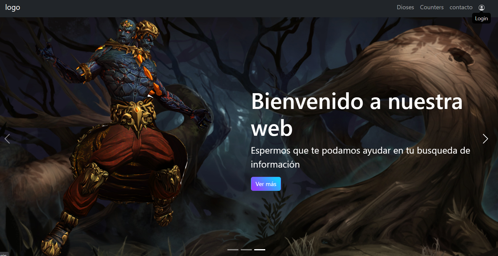
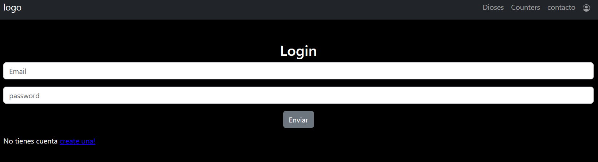
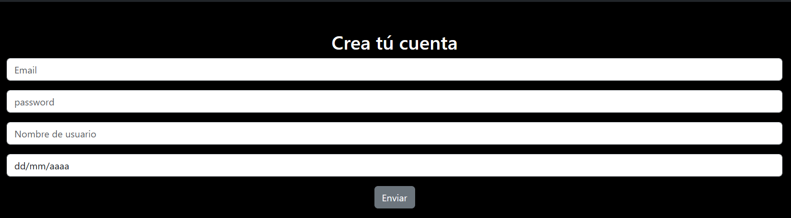
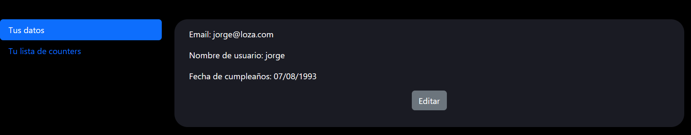
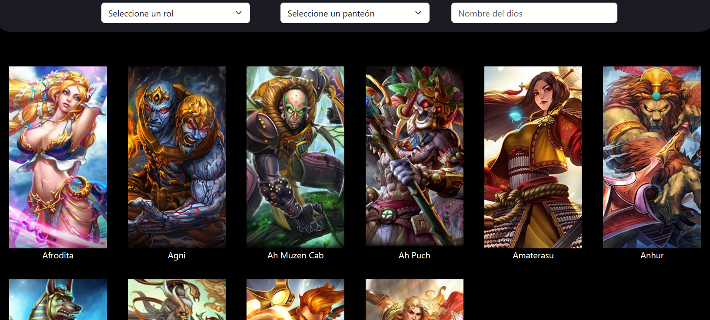
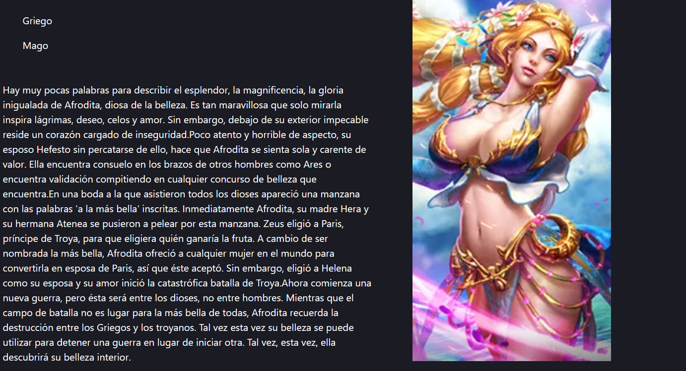

# Smite Counters

Lo que queremos hacer con esta página es; Informar a los jugadores de los distintos dioses jugables que existen en el juego de Smite, sus caracteristicas y mostrar una lista "Principal" de counters, en la que cualquier usuario podra consultar para poder crear sus estrageias, los usuarios logueado podran crearse sus propias listas y publicarlas, para que cualquier usuario pueda consultarla y valoralo positivamente si este le ha sido útil.

## Construido con 🛠️

* [BOOTSTRAP](https://getbootstrap.com/) - Usado para la estructura base de la web y el responsive
* [BOOTSTRAP-ICONS](https://icons.getbootstrap.com/)
* [TOASTIFY](https://www.npmjs.com/package/react-toastify)
* [REACT](https://es.react.dev/) 
* [AXIOS](https://axios-http.com/es/docs/intro) 
* [JWT-DECODE](https://www.npmjs.com/package/jwt-decode) 
* [REACT-REDUX](https://es.redux.js.org/) 
* [REACT-ROUTER-DOM](https://www.npmjs.com/package/react-router-dom)     

## Wiki 📖

Ahora te explicaremos como funciona nuestra web.

Home
 

 
Página principal, nos encontraremos un menú en la parte superior en la cual podremos navegar entre las distintas pagina de nuestra web, a continuación tenemos un carousel con información y debajo de esta tenemos cajas informativas.
Si hacemos click en el icono de la persona accederemos al login.

LOGIN

En esta página introduciremos nuestro email y contraseña para poder acceder, en caso de que no tengamos una cuenta con la cual hacer login, debajo del formulario tenemos un link que nos llevara a la página de singup.

SINGUP
 

En esta página, rellenaremos los campos para poder crearnos una cuenta y poder acceder a la web. Cuando rellenemos el formulario con la información necesario, realizara el login de forma automática y nos llevara a nuestro perfil.

Perfil

 
En esta página tendremos un panel con 2 secciones, el primero "Tus datos", aqui veremos nuestra información y si hacemos click en el botón de editar podremos modificar nuestros datos a excepción del email: Si hacemos click en "Tú lista de counter" veremos una tabla con todas nuestras listas y un botón para poder crearnos nuestra propia lista.

LISTA DE COUNTERS

En esta página, veremos lo siguiente; Una caja para colocarle un nombre a nuestra lista, debajo tendremos un desplegable con todos los dioses, al seleccionar un dios, mostraremos la imagen de este encima del deslplegable y a lado de esta caja tendremos los "Counters", una caja por el cual podremos buscar por nombre y debajo saldran todas las combinaciones, si hacemos click en el personaje, este se añadira a la lista de counters, en caso de que deseemos eliminarlos, simplemente hacemos click en el icono de borrar y se eliminara de la lista, junto a esta, tenemos 2 botones una de guardar y otra de eliminar, si hacemos click en eliminar borraremos la fila y si hacemos click en el botón de guardar, guardaremos toda la información de la fila en la base de datos

DIOSES

En el menú tendremos un apartado llamado "Dioses", si hacemos click, veremos lo que nos muestra la imagen de arriba, aquí se mostrarán todos los dioses, tendremos 3 filtros, por rol, por panteón y por nombre, cuando encontremos al dios deseado, podemos hacer click en el para que nos lleve a la página detalle.

DIOSES DETALLE

En esta página veremos toda la información relacionada con el dios, su historia, habilidades,daño por habilidad y skins

## Autores ✒️

* **Jorge Loza Guzmán** - *Trabajo Inicial* -  *Documentación* - [JorgeLozaDev](https://github.com/JorgeLozaDev)

## Licencia 📄

Este proyecto está bajo la Licencia (LICENSE) - mira el archivo [LICENSE](LICENSE) para detalles

---
⌨️ por [JorgeLozaDev](https://github.com/JorgeLozaDev) 